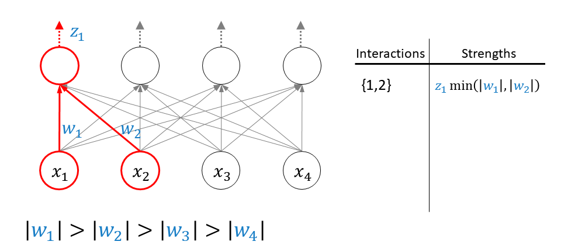

# Team 12 ML project (NID)





# Neural Interaction Detection (NID) Project

## Project Overview

This repository implements the Neural Interaction Detection (NID) algorithm for identifying feature interactions in predictive models. The goal of the project is to detect and interpret both pairwise and arbitrary-order interactions between features using a multilayer perceptron (MLP) network. The algorithm is tested on both synthetic datasets and real-world datasets such as the California Housing and Letter Recognition datasets.

### Key Features:
- **Neural Interaction Detection (NID)**: A method to identify feature interactions based on the learned weights of a neural network.
- **Multiple Experimentation**: The repository includes various experiments to demonstrate the effectiveness of NID in identifying interactions, including tests on synthetic data, multicollinearity effects, and real-world datasets.
- **Visualization**: The repository provides tools for visualizing interaction strengths via heatmaps and bar plots.

## Dependencies

The following libraries are required to run the code:

- `torch`: For building and training neural networks.
- `numpy`: For handling numerical data.
- `sklearn`: For data preprocessing and evaluation metrics.
- `pandas`: For data manipulation and processing.
- `matplotlib`: For generating plots and visualizations.
- `seaborn`: For advanced plotting.
- `statsmodels`: For statistical models and ANOVA testing.
- `tqdm`: For progress bars during experiments.

You can install the necessary dependencies by running:

```bash
pip install torch numpy sklearn pandas matplotlib seaborn statsmodels tqdm
```

## Project Structure

The repository is organized as follows:

- **`utils.py`**: Contains utility functions for data preprocessing, model training, and evaluation.
- **`multilayer_perceptron.py`**: Defines the MLP model architecture, training loop, and weight extraction functions.
- **`neural_interaction_detection.py`**: Contains the core logic for interpreting feature interactions using the trained model.
- **`experiments_final.ipynb`**: Jupyter notebook containing experiments, hypothesis testing, and result visualization.

## How to Execute Code

### 1. Clone the Repository
First, clone the repository to your local machine:

```bash
git clone https://github.com/Akmuhammet01/feature-interaction-analysis.git
cd NID-Project
```

### 2. Set Up the Environment
Ensure that the required libraries are installed. You can do this by creating a virtual environment and installing the dependencies listed above.

### 3. Running the Code
The primary entry point for running the code is through the Jupyter notebook `experiments_final.ipynb`. Open it in a Jupyter environment:

```bash
jupyter notebook experiments_final.ipynb
```

The notebook will walk you through various experiments, including:
- **Additive and Multiplicative Functions**: Evaluating interactions in controlled synthetic datasets.
- **Real-World Data**: Running experiments on real-world datasets like the California Housing and Letter Recognition datasets.
- **Multicollinearity and Correlated Features**: Studying how feature correlations affect the interaction detection process.
- **Permutation Test**: Estimating the power of detected interactions through permutation testing.

```
